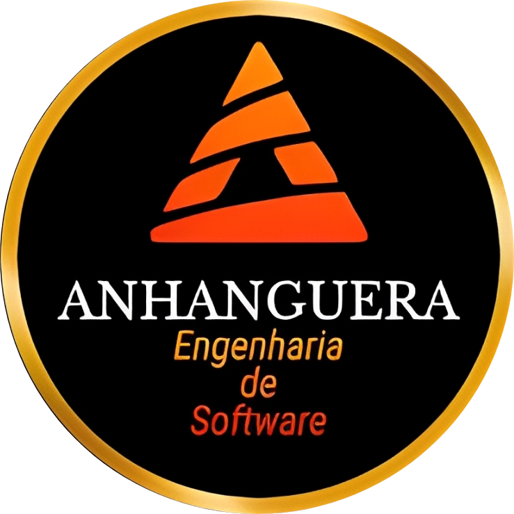
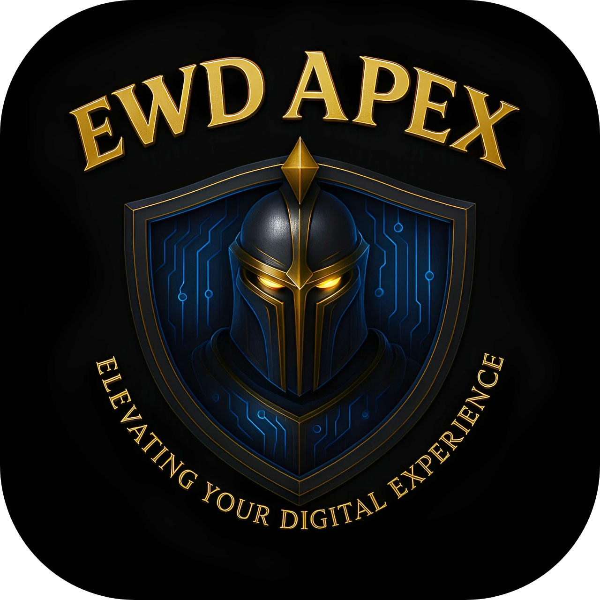

---
 

***

<h1 align="center"> 🏆 About me : 🏆 </h1>
 

  
  

>✔️&nbsp;&nbsp; Complete training in Full Stack Development. I have been a technology professional since January 2022, with diverse and promising know-how, solid training and daily improvement (studying Software Engineering since 2025). 
I have excellent communication skills in collaborating with heterogeneous and productive teams. 
> 
>✔️&nbsp;&nbsp;Familiar with the latest development tools, techniques and procedures. 
Always exploring new technologies and expanding software solutions. 
> 
>✔️&nbsp;&nbsp;I have the ability to change the context and deliver innovative results. 
I seek to bring ideas to life and deliver convincing work before the deadline. 
All this while closely monitoring design, accessibility and well-structured code. 
> 
>✔️&nbsp;&nbsp;I specialize in creating websites for companies of all sizes, segments and categories.I believe that clients should not settle for cheap solutions or generic templates and I always deliver customized projects with the best possible cost-benefit.

***

<h1 align="center">Hard Skills</h1>

>**Markup / Styling Languages**
>
   >
    
    
 ___
  
>**Programming Languages and Frameworks**
>
  >
   
   )
   
   
   
   
   
___

>**Package Managers**
>
  >
   
   
___

>**Examples of some libraries, APIs and SDKs that I have worked with** 
 >
  >
   
   
   
   
   
   
   
   
   
   
   
   
   
   
   
   
   
   
   
    
   
   
   
   
   
   🐶
___

>**DBMS's & ORM's**  
>
  >
   
   
   
   
   
   

___

>**DevOps**
>
  >
   
   
   
___

>**Development Tools**
>
  >
   
   
   
   

___

<h3 align="center">:earth_americas:

:calling::octocat::email:&nbsp;Contact Channels:&nbsp;:email::octocat::calling:</h3> 

 

        

___

<table align="center">
  <tr>
    <td>
      
    </td>
    <td>
      
    </td>
    <td>
      
    </td>
  </tr>
</table>

